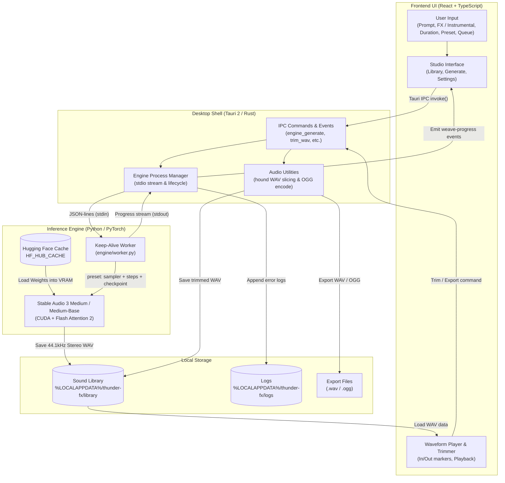

# Thunder FX

A Windows desktop app that generates sound effects and short instrumental clips on your own GPU. Type what you want, generate a clip, trim it, and save WAV or OGG.

Generation uses [Stable Audio 3 Medium](https://stability.ai/) locally. There is no cloud render, no mixer, and no pack of recorded samples — only new clips from text.

The UI is a dark gold-and-leather studio. It does not use Wizards of the Coast trademarks or art.

## What you can do

Three tabs: **Library**, **Generate**, and **Settings**.

### Generate

- Type a prompt and click **Generate**.
- **Sound effects** (default) or **Instrumental**. Same model either way. Instrumental uses a music-style prompt and a negative prompt that tries to avoid vocals.
- Clips can be **0.5 seconds to 6 minutes 20 seconds**. Instrumental defaults to 20 seconds.
- **Max speed / Balanced / Max quality** picks how the clip is generated. See [Quality presets](#quality-presets).
- **Load model** puts the model into GPU memory. Do that once after you open the app. **Generate** only makes a clip.
- **Browse prompts** opens bundled lists. Filter **FX** (`prompts/fx`) or **Ambience** (`prompts/ambience`, tabletop-style beds such as forest or tavern). **Preview** shows the full prompt. **Use** fills the current prompt. Check items — or a whole category — to add them to a queue.
- **Generate queue** runs queued prompts one after another and saves each clip. **Cancel** stops the clip in progress; the rest stay queued.
- After you have loaded or generated on this machine, **Load model**, **Generate**, and **Generate queue** show a `~m:ss` estimate. While work is in progress, the waveform clock also shows estimated remaining time.
- After a clip: waveform, play, trim in/out, export **WAV**. **OGG** export needs the desktop app, not the browser mock.

Extra controls (CFG, negative prompt, seed) stay collapsed unless you open them.

### Shape — editing after generation

The **Shape** panel next to the waveform edits the clip you already have, so none of it costs
GPU time:

| Control | What it does |
| :--- | :--- |
| **Fade in / out** | Equal-power ramps, so the level does not dip through the middle of the fade |
| **Reverse** | Plays the clip backwards |
| **Gain** | −24 to +24 dB |
| **Normalize** | Peak-normalizes to −1 dBFS in both directions; a near-silent clip is left alone |
| **Pitch & speed** | ±12 semitones by resampling, so the clip shortens as it rises — as on a sampler |
| **Variants** | Saves several re-pitched copies to the library, the usual way to stop a repeated footstep sounding machine-gunned |

Edits apply straight away, so playback and export follow them. **Undo** steps back through them;
**Save** writes them into the library file. Nothing touches disk until you save.

### Library

- Saved clips, newest first. Cards show a short prompt name; the full prompt appears when you open the clip on Generate.
- Search, filter, and delete.
- Click a clip to open it on Generate.
- **Triage:** star a favourite, rate 0-5, add free-text tags, or mark a reject. Rejects are
  hidden rather than deleted; favourite and reject clear each other. The filter bar narrows the
  library to favourites, a rating floor, or a combination of tags.
- **Rename** a clip to rename its WAV on disk, so the name in the library is the name it exports
  under. Its rating and tags follow the rename.
- **Delete moves the clip to the trash** (`<library>/.trash`) with an immediate Undo. **Trash**
  restores or permanently deletes; anything older than 30 days is cleared automatically.
- **Compare** two selected clips A/B at the same moment in each, with levels matched so the
  louder take does not simply win. `A`/`B` switch sides, space plays.
- Favourites, ratings, tags and renames live in `thunder-fx-meta.json` inside the library folder,
  so they travel with the audio when the folder is backed up or moved.
- An empty library shows a few starter prompts for the current mode (sound effects or instrumental).

On the desktop app, Generate writes WAV files to the generated-sounds folder. In the browser (`npm run dev`), clips stay in IndexedDB.

### Settings

- Generated-sounds folder (desktop default: `%LOCALAPPDATA%\thunder-fx\library`)
- Default export folder
- Default audio format for exports: WAV, AIFF, FLAC, Opus (default), OGG Vorbis, MP3, with bitrate/quality controls for the lossy encoders.
  Everything but WAV is encoded by the Python engine, so those need the desktop app.
- Hugging Face token and default duration
- Error log (newest first; Reveal file)
- **Updates:** the running version, and a check against the release channel. Installers built by
  the release workflow update in place; a local `tauri build` carries no update channel and says
  so.

Hover a control for a short explanation. **Ctrl+K** opens a command palette (tabs and error log).

## Run the app (UI + mock engine)

Node 22+:

```bash
npm install
npm run dev
```

The browser app is the UI with a **mock** engine. It does not load Medium or use the GPU.

```bash
npm test
npm run typecheck
npm run lint
```

## Desktop shell (Tauri)

Needs [Rust](https://rustup.rs/) and WebView2.

```bash
npm run tauri:dev
```

The engine is `engine/worker.py`. The desktop app prefers `engine/.venv` and runs CUDA Medium once that env is installed. Browser `npm run dev` still uses the mock. Force mock with `THUNDER_FX_MOCK_ENGINE=1`.

## GPU generation (CUDA)

Weights are **not** in this repo. They are under the [Stability AI Community License](https://stability.ai/license). The T5Gemma encoder is under [Gemma Terms of Use](https://ai.google.dev/gemma/terms).

You need an NVIDIA GPU with about **6 GB+ VRAM**. This Windows pin is **Python 3.12 + PyTorch 2.7.1+cu128 + Flash Attention 2.8.3** (prebuilt wheel — do not compile FA2):

1. Install Python 3.12 x64 and [uv](https://docs.astral.sh/uv/).
2. Sync the engine env (CUDA torch, **not** CPU torch):

```bash
cd engine
uv sync
```

`pyproject.toml` pulls `stable-audio-3` from GitHub and a matching Windows FA2 wheel. If `import flash_attn` fails, setup will show the technical error — do not skip it.

3. Run the worker (mock is off unless `THUNDER_FX_MOCK_ENGINE=1`):

```bash
engine\.venv\Scripts\python.exe -u engine\worker.py
```

The CUDA venv is about 4 GB; Medium + T5Gemma weights are several more GB. If `C:` is full, set `UV_CACHE_DIR` and `HF_HUB_CACHE` to a larger drive and junction `engine/.venv` / `engine/.hf-cache` there. Setup downloads weights into `HF_HUB_CACHE`. You need a Hugging Face login that has accepted the Stability Community License and Gemma Terms.

Quality is chosen with a **preset** rather than a step count — see [Quality presets](#quality-presets).
Precision defaults to FP16 (optional FP32 in Settings; FP32 also turns off chunked decode and
roughly doubles peak VRAM).

## Quality presets

Steps are not the quality dial on this model, and turning them up makes output worse.
Medium is **ARC-distilled** and sampled with `pingpong`, which re-injects fresh noise on
*every* step — so each extra step is another chance for the model to invent detail rather
than refine it. Stability's own default for this checkpoint is 8 steps at CFG 1.

A preset therefore changes the **checkpoint**, not just the step count. Deterministic
samplers (`euler`, `dpmpp`) are the only ones where extra steps converge — but they must
never run on Medium. Distillation trains the model *for* pingpong's per-step re-noising, so
stepping through it deterministically averages the texture away: the result is muffled, flat,
and the same from end to end. Deterministic sampling belongs on Medium-Base, which was never
distilled.

**On Medium alone, Balanced is as good as it gets.** That is why Max quality needs the
Medium-Base download rather than a different sampler.

| Preset | Checkpoint | Sampler | Steps | CFG | Negative prompt |
| :--- | :--- | :--- | ---: | ---: | :--- |
| **Max speed** | `medium` | pingpong | 8 | 1.0 | ignored |
| **Balanced** (default) | `medium` | pingpong | 20 | 1.0 | ignored |
| **Max quality** — sound effects | `medium-base` | euler | 50 | 4.0 | **active** |
| **Max quality** — ambience | `medium-base` | euler | 50 | 2.0 | **active** |
| **Max quality** — instrumental | `medium` | pingpong | 20 | 1.0 | ignored |

**Max quality is tuned per content type, because guidance strength has to be.**
Sweeping CFG 1/2/4/7 on `medium-base`: a door slam was brightest at CFG 4–7 (+3% to +17%
spectral centroid vs Balanced), while a rain bed went the *other* way — +24% brightness and
+84% high-band energy at CFG 2, but by CFG 7 it had lost 9% brightness and most of its level
movement. More guidance sharpens a one-shot and dulls a bed.

Instrumental is the honest exception: **no CFG tested beat Balanced.** `medium-base` came out
consistently darker (−38% to −51% centroid) and less varied at every setting, so Max quality
keeps instrumental on Medium rather than promising an upgrade it does not deliver. That is a
stated per-mode decision, not a silent substitution — and it means Max quality for instrumental
needs no download and never refuses.

Set the default in **Settings → Default quality**. Override it per clip on Generate, and per
run with the **Run queue at** control next to Generate queue; each queued item otherwise keeps
the preset it was added with.

**Negative prompts only work on Max quality.** The model's guidance branch is skipped entirely
at CFG 1, so on the fast presets the negative field is never read — the UI marks it inactive.
Vocal suppression on those presets comes from the positive `VocalType: Instrumental` tag instead.

Max quality needs `medium-base`, a separate **~9 GB** download (**Settings → Download
Medium-Base**). Unlike Medium it is not a gated repo, but it shares Medium's T5Gemma text
encoder, so Medium has to be installed first. It is the un-distilled checkpoint —
`diffusion_objective: rectified_flow`, no ARC post-training — and Stability's own demo settings
for it are 50 steps at CFG 2–7, which is what this preset uses.

> [!NOTE]
> Medium-Base is a much heavier model than Medium and needs **noticeably more VRAM**. The
> checkpoint is loaded in fp32 and converted to fp16 afterwards, so the peak during loading is
> higher again. The 6 GB floor quoted above covers Medium; Max quality wants more headroom than
> that. Switching presets across the Medium / Medium-Base boundary is a real unload and reload,
> so it is a Settings-level choice rather than something to toggle per clip. Until it is installed, selecting Max quality **refuses to
generate** and says exactly what to do about it — it never quietly runs something else. There is
no fallback anywhere in the preset system, by design: an earlier version substituted a
deterministic sampler on Medium, the takes came out muffled and flat, and the substitution is
what made that hard to trace.

`THUNDER_FX_BASE_MODEL_READY=0` forces the "not installed" state, so the refusal path can be
checked without deleting the weights.

Moving the **Steps** slider in Advanced switches the preset to *Custom* and warns if you push
steps high on `pingpong` — that exact combination is what degrades output. A deterministic
sampler can never be selected for Medium; `engine/worker.py` coerces it back to pingpong.

Two tests guard this. `engine/test_quality.py` asserts no preset can put a deterministic
sampler on the distilled checkpoint, and `engine/test_generation_quality.py` actually generates
at each preset on the GPU and fails if a higher preset loses dynamics, brightness or variety:

```bash
engine\.venv\Scripts\python.exe -m unittest engine.test_generation_quality -v
```

To pick sampler and step counts from evidence rather than assertion:

```bash
engine\.venv\Scripts\python.exe scripts/bench_sampler.py
```

It sweeps sampler × steps × content type into `bench/`, with a `metrics.csv` and a blind A/B
player at `bench/index.html`.

## Prompt format

Prompts are normalised into the shape Stable Audio 3 was trained on before they reach the
model — `TrackType:` and `VocalType:` control tags, a trailing `BPM: N.` for music, and a
`Length: N seconds` tag re-derived from the duration you actually picked. The shipped catalog
is stored in that same form. Keep prompts under 45 words; Stability's own prompt rewriter
rejects its output past that length, and Thunder FX warns when you cross it.

```bash
python scripts/rewrite_prompts.py --check
```

## Loudness

Generated clips used to land anywhere from −16 to −28 dBFS RMS, because peak normalization only
ever attenuated. Mastering is now per content type:

| Mode | Target | Why |
| :--- | :--- | :--- |
| Sound effects | −1.0 dBFS peak, both directions | a game engine triggers one-shots at unity, so a predictable peak is what matters |
| Ambience | −20 LUFS integrated, peak-limited to −1.0 dBFS | beds sit under dialogue the same way every time |
| Instrumental | −18 LUFS integrated, peak-limited to −1.0 dBFS | matches game-music delivery convention |

Loudness is measured with a full ITU-R BS.1770-4 implementation (K-weighting, 400 ms blocks,
−70 LUFS absolute and −10 LU relative gates), verified against the EBU Tech 3341 reference tone.
Near-silent clips are left alone rather than amplified into noise, and 16-bit quantization is
TPDF-dithered without disturbing true digital silence.

## Performance benchmarks & estimates

Thunder FX uses empirical performance benchmark models to predict generation and model load times. When launching a newly built executable, prior local estimates are automatically wiped and reset to these baseline benchmarks until new machine runs are recorded.

### Hardware reference benchmarks (NVIDIA GeForce RTX 3090 24 GB)

| Operation | Precision | Measured Time | Storage Medium |
| :--- | :--- | :--- | :--- |
| **Model Cold Load** | FP16 | **~3.5 s** | NVMe SSD (Samsung 980 PRO / Kingston SA2000) |
| **Model Cold Load** | FP32 | **~5.2 s** | NVMe SSD |
| **Model Cold Load** | FP16 | **221.4 s (~3.7 min)** | Mechanical SATA HDD (Toshiba HDWD240) |
| **Model Cold Load** | FP32 | **330.2 s (~5.5 min)** | Mechanical SATA HDD (Toshiba HDWD240) |
| **Fast Preview (1s @ 4 steps)** | FP16 | **~4.8 s** | CUDA / Flash Attention 2; first-run phase model, model already loaded |

The load times and Fast Preview row are the first-run estimates in `src/lib/perfBenchmarks.ts`. Reprint them with `python scripts/bench_estimates.py`. An older Fast Preview wall of **12.6 s** included 6 s of denoised padding that the clip then threw away; that padding is now 0.5–1 s (PQ-01).

> [!TIP]
> Keep `HF_HUB_CACHE` on an **NVMe SSD** (e.g. `D:\huggingface\hub` or `C:\Users\<User>\.cache\huggingface\hub`) for near-instant cold loads (~3–5s) rather than a mechanical hard drive.

### Performance estimates across parameter variations

| Tier / Variation | Duration | Steps | Precision | Est. Compute Time | Real-Time Factor (RTF) | Est. VRAM |
| :--- | :--- | :--- | :--- | :--- | :--- | :--- |
| **Micro UI Click** | 0.5 s | 4 | FP16 | **~4.8 s** | 9.6× | ~6.2 GB |
| **Micro UI Click (HQ)** | 0.5 s | 4 | FP32 | **~7.0 s** | 14.0× | ~12.8 GB |
| **Quick Footstep / Foley** | 1.5 s | 8 | FP16 | **~6.6 s** | 4.4× | ~6.2 GB |
| **Quick Action Impact** | 3.0 s | 15 | FP16 | **~9.9 s** | 3.3× | ~6.2 GB |
| **Standard SFX (Default)** | 8.0 s | 20 | FP16 | **~14.5 s** | 1.8× | ~6.3 GB |
| **Standard SFX (FP32)** | 8.0 s | 20 | FP32 | **~20.6 s** | 2.6× | ~12.9 GB |
| **Detailed Creature Roar** | 10.0 s | 30 | FP16 | **~19.4 s** | 1.9× | ~6.3 GB |
| **Short Music Stinger** | 15.0 s | 20 | FP16 | **~17.7 s** | 1.2× | ~6.3 GB |
| **Music Bed (Default)** | 20.0 s | 20 | FP16 | **~20.0 s** | 1.0× | ~6.4 GB |
| **Music Bed (FP32)** | 20.0 s | 20 | FP32 | **~28.8 s** | 1.4× | ~13.1 GB |
| **Refined Music Track** | 30.0 s | 35 | FP16 | **~38.7 s** | 1.3× | ~6.4 GB |
| **Seamless Loop Bed** | 45.0 s | 20 | FP16 | **~31.5 s** | 0.7× | ~6.6 GB |
| **Extended Atmosphere** | 60.0 s | 25 | FP16 | **~45.7 s** | 0.8× | ~6.7 GB |
| **Long Ambience Cue** | 120.0 s | 20 | FP16 | **~66.0 s** | 0.6× | ~7.2 GB |
| **Dungeon Exploration Bed**| 180.0 s | 20 | FP16 | **~93.6 s** | 0.5× | ~7.6 GB |
| **Epic Siege Ambience** | 240.0 s | 20 | FP16 | **~121.2 s** | 0.5× | ~8.1 GB |
| **Max Duration Limit** | 380.0 s | 20 | FP16 | **~185.6 s** | 0.5× | ~9.2 GB |
| **Max Duration Limit (FP32)**| 380.0 s | 20 | FP32 | **~273.6 s** | 0.7× | ~18.9 GB |
| **Studio High-Step Master** | 8.0 s | 50 | FP32 | **~38.8 s** | 4.9× | ~12.9 GB |
| **Studio Ultra Master** | 8.0 s | 100 | FP32 | **~69.8 s** | 8.7× | ~12.9 GB |
| **Fast 4-Takes Casting** | 1.5 s (×4) | 4 | FP16 | **~20.4 s** | 3.4× | ~6.2 GB |
| **Standard 4-Takes Casting**| 8.0 s (×4) | 20 | FP16 | **~58.0 s** | 1.8× | ~6.3 GB |
| **Music 4-Takes Casting** | 20.0 s (×4) | 20 | FP16 | **~80.0 s** | 1.0× | ~6.4 GB |

### Running performance benchmark tests

```bash
npm test src/lib/perfBenchmarks.test.ts
```

## How it works



## Layout

- `src/` — React studio (Library, Generate, Settings; first-run setup)
- `engine/` — JSON-lines Python engine
- `src-tauri/` — Tauri 2 window, trim, engine spawn
- `docs/designs/` — scene specs + HTML prototypes
- `features/` — Gherkin acceptance specs
- `prompts/fx` — sound-effect prompts (Browse prompts → FX)
- `prompts/ambience` — ambience prompts (Browse prompts → Ambience)

App code is Apache-2.0 (see `LICENSE`). Model weights are downloaded separately and remain under Stability’s license.

## Releasing

Versions live in three manifests plus the changelog, and CI fails if they disagree:

```bash
npm run version:check
```

To cut a release, bump all three at once, then tag:

```bash
npm run version:set 0.5.0 && npm install
```

Push the tag (`git tag v0.5.0 && git push --follow-tags`) and
`.github/workflows/release.yml` builds and signs a Windows installer, then opens a draft release.

The updater needs a signing keypair, generated once:

```bash
npx @tauri-apps/cli signer generate -w ~/.tauri/thunder-fx.key
```

Add three repository secrets from it — `TAURI_SIGNING_PRIVATE_KEY` (the private key),
`TAURI_SIGNING_PRIVATE_KEY_PASSWORD`, and `TAURI_UPDATER_PUBKEY` (the `.pub` file). Keep the
private key out of the repository; the workflow stamps only the public half into
`src-tauri/tauri.updater.conf.json` at build time. A local `tauri build` merges none of that,
so it produces a working app with no update channel rather than failing.

## Release notes

See [CHANGELOG.md](CHANGELOG.md) for 0.3.0 (instrumental mode, Browse prompts, queue) and 0.2.0 (Library / Generate / Settings tabs).
