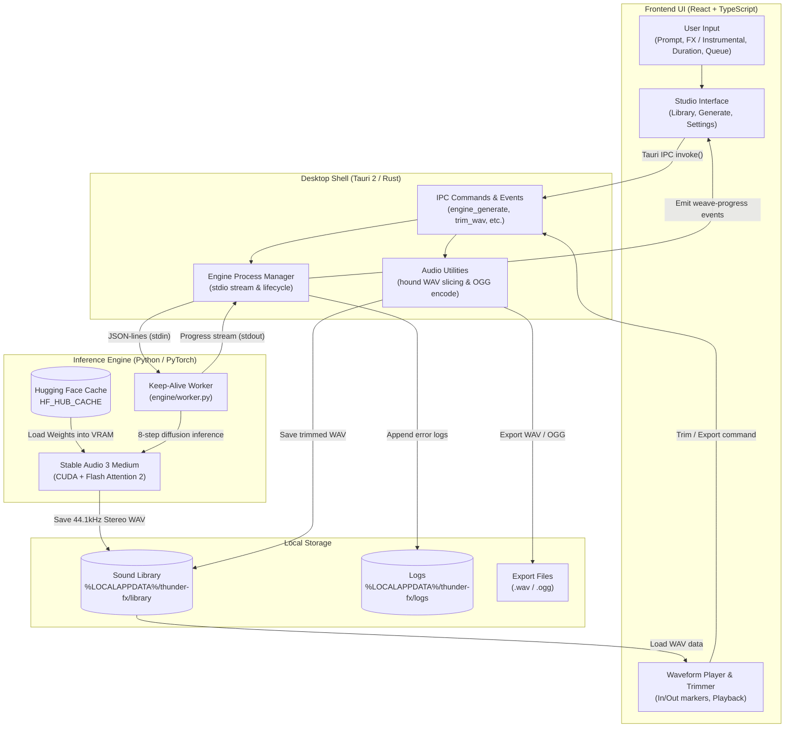

# Thunder FX

A Windows desktop app that generates sound effects and short instrumental clips on your own GPU. Type what you want, generate a clip, trim it, and save WAV or OGG.

Generation uses [Stable Audio 3 Medium](https://stability.ai/) locally. There is no cloud render, no mixer, and no pack of recorded samples — only new clips from text.

The UI is a dark gold-and-leather studio. It does not use Wizards of the Coast trademarks or art.

## What you can do

Three tabs: **Library**, **Generate**, and **Settings**.

### Generate

- Type a prompt and click **Generate**.
- **Sound effects** (default) or **Instrumental**. Same model either way. Instrumental uses a music-style prompt and a negative prompt that tries to avoid vocals.
- Clips can be **0.5 seconds to 6 minutes 20 seconds**. Instrumental defaults to 20 seconds.
- **Load model** puts the model into GPU memory. Do that once after you open the app. **Generate** only makes a clip.
- **Browse prompts** opens bundled lists. Filter **FX** (`prompts/fx`) or **Ambience** (`prompts/ambience`, tabletop-style beds such as forest or tavern). **Preview** shows the full prompt. **Use** fills the current prompt. Check items — or a whole category — to add them to a queue.
- **Generate queue** runs queued prompts one after another and saves each clip. **Cancel** stops the clip in progress; the rest stay queued.
- After you have loaded or generated on this machine, **Load model**, **Generate**, and **Generate queue** show a `~m:ss` estimate. While work is in progress, the waveform clock also shows estimated remaining time.
- After a clip: waveform, play, trim in/out, export **WAV**. **OGG** export needs the desktop app, not the browser mock.

Extra controls (CFG, negative prompt, seed) stay collapsed unless you open them.

### Library

- Saved clips, newest first. Cards show a short prompt name; the full prompt appears when you open the clip on Generate.
- Search and delete.
- Click a clip to open it on Generate.
- An empty library shows a few starter prompts for the current mode (sound effects or instrumental).

On the desktop app, Generate writes WAV files to the generated-sounds folder. In the browser (`npm run dev`), clips stay in IndexedDB.

### Settings

- Generated-sounds folder (desktop default: `%LOCALAPPDATA%\thunder-fx\library`)
- Default export folder
- Hugging Face token and default duration
- Error log (newest first; Reveal file)

Hover a control for a short explanation. **Ctrl+K** opens a command palette (tabs and error log).

## Run the app (UI + mock engine)

Node 22+:

```bash
npm install
npm run dev
```

The browser app is the UI with a **mock** engine. It does not load Medium or use the GPU.

```bash
npm test
npm run typecheck
npm run lint
```

## Desktop shell (Tauri)

Needs [Rust](https://rustup.rs/) and WebView2.

```bash
npm run tauri:dev
```

The engine is `engine/worker.py`. The desktop app prefers `engine/.venv` and runs CUDA Medium once that env is installed. Browser `npm run dev` still uses the mock. Force mock with `THUNDER_FX_MOCK_ENGINE=1`.

## GPU generation (CUDA)

Weights are **not** in this repo. They are under the [Stability AI Community License](https://stability.ai/license). The T5Gemma encoder is under [Gemma Terms of Use](https://ai.google.dev/gemma/terms).

You need an NVIDIA GPU with about **6 GB+ VRAM**. This Windows pin is **Python 3.12 + PyTorch 2.7.1+cu128 + Flash Attention 2.8.3** (prebuilt wheel — do not compile FA2):

1. Install Python 3.12 x64 and [uv](https://docs.astral.sh/uv/).
2. Sync the engine env (CUDA torch, **not** CPU torch):

```bash
cd engine
uv sync
```

`pyproject.toml` pulls `stable-audio-3` from GitHub and a matching Windows FA2 wheel. If `import flash_attn` fails, setup will show the technical error — do not skip it.

3. Run the worker (mock is off unless `THUNDER_FX_MOCK_ENGINE=1`):

```bash
engine\.venv\Scripts\python.exe -u engine\worker.py
```

The CUDA venv is about 4 GB; Medium + T5Gemma weights are several more GB. If `C:` is full, set `UV_CACHE_DIR` and `HF_HUB_CACHE` to a larger drive and junction `engine/.venv` / `engine/.hf-cache` there. Setup downloads weights into `HF_HUB_CACHE`. You need a Hugging Face login that has accepted the Stability Community License and Gemma Terms.

Quality settings are fixed: fp32, 8 steps, unchunked decode (retry chunked only on CUDA OOM). There is no quality slider.

## How it works



## Layout

- `src/` — React studio (Library, Generate, Settings; first-run setup)
- `engine/` — JSON-lines Python engine
- `src-tauri/` — Tauri 2 window, trim, engine spawn
- `docs/designs/` — scene specs + HTML prototypes
- `features/` — Gherkin acceptance specs
- `prompts/fx` — sound-effect prompts (Browse prompts → FX)
- `prompts/ambience` — ambience prompts (Browse prompts → Ambience)

App code is Apache-2.0 (see `LICENSE`). Model weights are downloaded separately and remain under Stability’s license.

## Release notes

See [CHANGELOG.md](CHANGELOG.md) for 0.3.0 (instrumental mode, Browse prompts, queue) and 0.2.0 (Library / Generate / Settings tabs).
